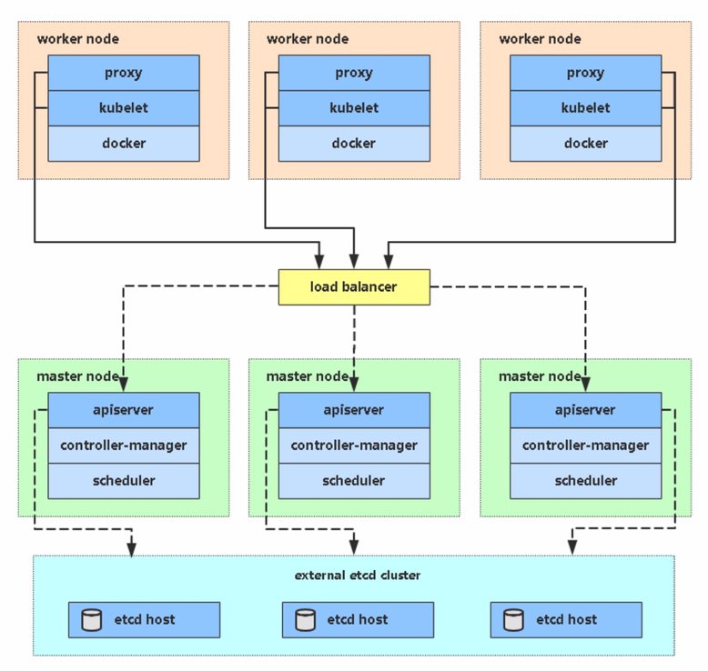

# 部署Kubernetes集群


---

## 二进制部署Kubernetes集群
## 1、生产环境k8s平台架构

- 单master集群


- 多master集群（HA）



## 2、服务器规划
| 角色 | IP | 组件 |
| :----:| :----: | :----: |
| k8s-master | 172.31.205.62 | kube-apiserver kube-controller-manager kube-scheduller etcd01 |
| k8s-node01 | 172.31.205.62 | kubelet kube-proxy docker etcd02 |
| k8s-node01 | 172.31.205.62 | kubelet kube-proxy docker etcd03 |

> 此内容采用system方式启动服务，详内容中supervisor方式启动 

## 3、系统初始化设置
- 1、设置主机名
```
# 警告：请分别设置对应的主机名
hostnamectl set-hostname --static k8s-master && bash
hostnamectl set-hostname --static k8s-node01 && bash
hostnamectl set-hostname --static k8s-node02 && bash

# 显示当前主机名设置
hostnamectl status
# 设置 hostname 解析
echo "127.0.0.1   $(hostname)" >> /etc/hosts
# 设置集群主机名解析（ALL）
echo "172.31.205.53   k8s-master" >> /etc/hosts
echo "172.31.205.54   k8s-node01" >> /etc/hosts
echo "172.31.205.55   k8s-node02" >> /etc/hosts
```
- 2、关闭防火墙
```
setenforce 0
sed -i 's/^SELINUX=enforcing$/SELINUX=permissive/' /etc/selinux/config
sed -i 's/^SELINUX=permissive$/SELINUX=disabled/' /etc/selinux/config
# 关闭firewalld服务
systemctl stop firewalld.service
systemctl disable firewalld.service

```

## 4、自签CA颁发证书
### 4.1、安装cfssl工具
```
mkdir -p /opt/kubernetes/pki
cd /opt/kubernetes/pki
curl -L https://pkg.cfssl.org/R1.2/cfssl_linux-amd64 -o /usr/bin/cfssl
curl -L https://pkg.cfssl.org/R1.2/cfssljson_linux-amd64 -o /usr/bin/cfssljson
curl -L https://pkg.cfssl.org/R1.2/cfssl-certinfo_linux-amd64 -o /usr/bin/cfssl-certinfo
# 添加执行权限
chmod +x /usr/bin/cfssl*

```
### 4.2、生成CA证书
#### 4.2.1 创建CA证书请求文件（csr）
```
cat > /opt/kubernetes/pki/ca-csr.json <<EOF
{
    "CN": "kubernetes-ca",
    "hosts": [
    ],
    "key": {
        "algo": "rsa",
        "size": 2048
    },
    "names": [
        {
            "C": "CN",
            "ST": "Beijing",
            "L": "Beijing",
            "O": "kubernetes",
            "OU": "System"
        }
    ],
    "ca": {
        "expiry": "87600h"
    }
}
EOF
# 生成CA证书和私钥
cfssl gencert -initca ca-csr.json | cfssljson -bare ca

```
#### 4.2.2 创建基于根证书的config配置文件

```
cat > /opt/kubernetes/pki/ca-config.json <<EOF
{
    "signing": {
        "default": {
            "expiry": "87600h"
        },
        "profiles": {
            "server": {
                "expiry": "87600h",
                "usages": [
                    "signing",
                    "key encipherment",
                    "server auth"
                ]
            },
            "client": {
                "expiry": "87600h",
                "usages": [
                    "signing",
                    "key encipherment",
                    "client auth"
                ]
            },
            "peer": {
                "expiry": "87600h",
                "usages": [
                    "signing",
                    "key encipherment",
                    "server auth",
                    "client auth"
                ]
            }
        }
    }
}
EOF

```


## 5、部署etcd集群
 
> 首先创建etcd的请求文件,此请求文件是在`CA`机器上来完成

### 5.1 创建etcd证书请求文件

> 实际部署中,请修改"hosts"参数中ip地址(运行etcd的服务,非ip地址段)
>
> 否则在启动etcd的时候会报证书相关错误

```
cat > /opt/kubernetes/pki/etcd-peer-csr.json <<EOF
{
    "CN": "k8s-etcd",
    "hosts": [
        "172.31.205.53",
        "172.31.205.54",
        "172.31.205.55"
    ],
    "key": {
        "algo": "rsa",
        "size": 2048
    },
    "names": [
        {
            "C": "CN",
            "ST": "Beijing",
            "L": "Beijing",
            "O": "kubernetes",
            "OU": "System"
        }
    ]
}
EOF
# 签发etcd证书
cfssl gencert -ca=ca.pem -ca-key=ca-key.pem -config=ca-config.json -profile=peer etcd-peer-csr.json | cfssljson -bare etcd

```

> etcd采用集群模式(3台),所以分别在`master(etcd-01)` `node01(etcd-02)` `node02(etcd-03)`安装部署

### 5.2 下载etcd安装包
- 实际规划etcd集群至少为3台机器,集群方式下在所有机器上执行操作
  - [默认使用github下载](https://github.com/etcd-io/etcd/releases/download/v3.3.25/etcd-v3.3.25-linux-amd64.tar.gz)
```
mkdir -p /opt/src/
curl -L https://github.com/etcd-io/etcd/releases/download/v3.3.25/etcd-v3.3.25-linux-amd64.tar.gz -o /opt/src/etcd-v3.3.25-linux-amd64.tar.gz

tar zxf /opt/src/etcd-v3.3.25-linux-amd64.tar.gz -C /opt/src/
mv /opt/src/etcd-v3.3.25-linux-amd64 /opt/src/etcd-v3.3.25
# 为etcd做软链接,方便更新升级
ln -s /opt/src/etcd-v3.3.25 /opt/src/etcd
# 创建存放etcd证书目录
mkdir -p /opt/src/etcd/{pki,logs}
```
#### 5.2.1 加速下载
```
curl -L https://mirrors.huaweicloud.com/etcd/v3.2.31/etcd-v3.2.31-linux-amd64.tar.gz -o /opt/src/etcd-v3.2.31-linux-amd64.tar.gz

curl -L https://mirrors.huaweicloud.com/etcd/v3.3.25/etcd-v3.3.25-linux-amd64.tar.gz -o /opt/src/etcd-v3.3.25-linux-amd64.tar.gz
```

### 5.3 配置etcd
#### 5.3.1 拷贝密钥到node节点
```
# master生成密钥
# ssh-keygen -t rsa -P ''
# -P表示密码，-P就表示空密码，也可以不用-P参数，这样就需要输入三次回车，用-P就输入一次回车。
ssh-keygen -t rsa
ssh-copy-id -i ~/.ssh/id_rsa.pub  root@k8s-node01
ssh-copy-id -i ~/.ssh/id_rsa.pub  root@k8s-node02
```
#### 5.3.2 拷贝证书到node节点
```
# 3、拷贝证书
# master
cp /opt/kubernetes/pki/ca.pem /opt/src/etcd/pki/
cp /opt/kubernetes/pki/etcd.pem /opt/src/etcd/pki/
cp /opt/kubernetes/pki/etcd-key.pem /opt/src/etcd/pki/
# node01
scp /opt/kubernetes/pki/ca.pem k8s-node01:/opt/src/etcd/pki/
scp /opt/kubernetes/pki/etcd.pem k8s-node01:/opt/src/etcd/pki/
scp /opt/kubernetes/pki/etcd-key.pem k8s-node01:/opt/src/etcd/pki/
# node02
scp /opt/kubernetes/pki/ca.pem k8s-node02:/opt/src/etcd/pki/
scp /opt/kubernetes/pki/etcd.pem k8s-node02:/opt/src/etcd/pki/
scp /opt/kubernetes/pki/etcd-key.pem k8s-node02:/opt/src/etcd/pki/
```

> 警告：系统启动服务文件中的ip地址需要手动去更改,因为每台机器的监听ip地址不同,涉及需要更改的参数如下：
- --listen-peer-urls
- --listen-client-urls
- --advertise-client-urls
- --initial-advertise-peer-urls

> [可选项] 如果想使用supervisor方式启动etcd和kubernetes组件服务,请点击跳转“使用spuervisor启动etcd”并忽略下方 “5.3.3 创建etcd系统服务”

- 1、[使用spuervisor启动etcd](./supervisor.md)

> 建议配置system和supervisor两个启动服务配置,保证服务启动可靠性

#### 5.3.3 创建etcd系统服务
```
cat > /lib/systemd/system/etcd.service <<EOF
[Unit]
Description=Etcd Server
Documentation=https://github.com/coreos
After=network.target
Wants=network-online.target

[Service]
Type=notify
WorkingDirectory=/opt/src/etcd/
ExecStart=/opt/src/etcd/etcd --name etcd-01 \\
  --listen-peer-urls https://172.31.205.53:2380 \\
  --listen-client-urls https://172.31.205.53:2379,http://127.0.0.1:2379 \\
  --quota-backend-bytes 8000000000 \\
  --advertise-client-urls https://172.31.205.53:2379,http://127.0.0.1:2379 \\
  --initial-cluster etcd-01=https://172.31.205.53:2380,etcd-02=https://172.31.205.54:2380,etcd-03=https://172.31.205.55:2380 \\
  --data-dir /opt/src/etcd/data/ \\
  --initial-advertise-peer-urls https://172.31.205.53:2380 \\
  --ca-file /opt/src/etcd/pki/ca.pem \\
  --cert-file /opt/src/etcd/pki/etcd.pem \\
  --key-file /opt/src/etcd/pki/etcd-key.pem \\
  --client-cert-auth   --trusted-ca-file /opt/src/etcd/pki/ca.pem \\
  --peer-ca-file /opt/src/etcd/pki/ca.pem \\
  --peer-cert-file /opt/src/etcd/pki/etcd.pem \\
  --peer-key-file /opt/src/etcd/pki/etcd-key.pem \\
  --peer-client-cert-auth \\
  --peer-trusted-ca-file /opt/src/etcd/pki/ca.pem \\
  --log-output stdout

TimeoutSec=0
RestartSec=2
Restart=always
LimitNOFILE=65536

[Install]
WantedBy=multi-user.target
EOF
# 启动etcd服务
systemctl daemon-reload
systemctl restart etcd
systemctl enable etcd
```
#### 5.3.4 查看etcd集群状态
```
# /opt/src/etcd/etcdctl cluster-health
# 软链接etcd命令
ln -s /opt/src/etcd/etcdctl /usr/local/sbin/
# 查看etcd集群健康检查
etcdctl cluster-health
member 26bb67943ff3802a is healthy: got healthy result from http://127.0.0.1:2379
member 68b27ec2be75f5c1 is healthy: got healthy result from http://127.0.0.1:2379
member ddae50d640aac69b is healthy: got healthy result from http://127.0.0.1:2379
cluster is healthy

# 查看etcd集群在线状态
etcdctl member list
cfeb24d3c6969a88: name=etcd-02 peerURLs=https://172.31.205.54:2380 clientURLs=http://127.0.0.1:2379,https://172.31.205.54:2379 isLeader=false
ef8033e5768a832a: name=etcd-03 peerURLs=https://172.31.205.55:2380 clientURLs=http://127.0.0.1:2379,https://172.31.205.55:2379 isLeader=false
f1de9d5a9c924cc5: name=etcd-01 peerURLs=https://172.31.205.53:2380 clientURLs=http://127.0.0.1:2379,https://172.31.205.53:2379 isLeader=true
```

## 6、安装Master节点组件

> Mater节点包括：kube-apiserver、kube-controller-manager、kube-scheduler和etcd

### 6.1 部署kube-apiserver
#### 6.1.1 下载kubernetes安装包
```
# 下载kubernetes二进制包
# wget -c -P /opt/src https://dl.k8s.io/v1.16.15/kubernetes-server-linux-amd64.tar.gz
# curl -L https://dl.k8s.io/v1.16.15/kubernetes-server-linux-amd64.tar.gz -o /opt/src/kubernetes-server-linux-amd64.tar.gz
curl -L https://dl.k8s.io/v1.18.8/kubernetes-server-linux-amd64.tar.gz -o /opt/src/kubernetes-server-linux-amd64.tar.gz

tar zxf /opt/src/kubernetes-server-linux-amd64.tar.gz -C /opt/src/
mv /opt/src/kubernetes /opt/src/kubernetes-v1.18.8
ln -s /opt/src/kubernetes-v1.18.8 /opt/src/kubernetes
# 删除无用的镜像文件
rm -rf /opt/src/kubernetes/server/bin/*.tar
rm -rf /opt/src/kubernetes/server/bin/*_tag
```
#### 6.1.2 签发client证书
> 注意：apiserver在与etcd进行通信时，此时apiserver为客户端etcd为服务端，因此需要client证书加密通信。
```
cat > /opt/kubernetes/pki/client-csr.json <<EOF
{
    "CN": "k8s-node",
    "hosts": [
    "172.31.205.53",
    "172.31.205.54",
    "172.31.205.55"
    ],
    "key": {
        "algo": "rsa",
        "size": 2048
    },
    "names": [
        {
            "C": "CN",
            "ST": "Beijing",
            "L": "Beijing",
            "O": "kubernetes",
            "OU": "System"
        }
    ]
}
EOF
# 签发client证书
cfssl gencert -ca=ca.pem -ca-key=ca-key.pem -config=ca-config.json -profile=client client-csr.json | cfssljson -bare client
```
#### 6.1.3 签发apiserver（server）证书
> 当其他客户端与apiserver进行通信时,也需要TLS认证，此时apiserver为服务端
```
cat > /opt/kubernetes/pki/apiserver-csr.json <<EOF
{
    "CN": "apiserver",
    "hosts": [
        "127.0.0.1",
        "172.31.205.53",
        "kubernetes.default",
        "kubernetes.default.svc",
        "kubernetes.default.svc.cluster",
        "kubernetes.default.svc.cluster.local"
    ],
    "key": {
        "algo": "rsa",
        "size": 2048
    },
    "names": [
        {
            "C": "CN",
            "ST": "Beijing",
            "L": "Beijing",
            "O": "kubernetes",
            "OU": "System"
        }
    ]
}
EOF
# 签发apiserver证书
cfssl gencert -ca=ca.pem -ca-key=ca-key.pem -config=ca-config.json -profile=server apiserver-csr.json | cfssljson -bare apiserver
```
#### 6.1.4 配置apiserver日志审计
```
# 创建存放证书目录
mkdir -p /opt/src/kubernetes/server/bin/{pki,conf}
# 配置apiserver日志审计
cat > /opt/src/kubernetes/server/bin/conf/audit.yaml <<EOF
apiVersion: audit.k8s.io/v1beta1 # This is required.
kind: Policy
# Don't generate audit events for all requests in RequestReceived stage.
omitStages:
  - "RequestReceived"
rules:
  # Log pod changes at RequestResponse level
  - level: RequestResponse
    resources:
    - group: ""
      # Resource "pods" doesn't match requests to any subresource of pods,
      # which is consistent with the RBAC policy.
      resources: ["pods"]
  # Log "pods/log", "pods/status" at Metadata level
  - level: Metadata
    resources:
    - group: ""
      resources: ["pods/log", "pods/status"]

  # Don't log requests to a configmap called "controller-leader"
  - level: None
    resources:
    - group: ""
      resources: ["configmaps"]
      resourceNames: ["controller-leader"]

  # Don't log watch requests by the "system:kube-proxy" on endpoints or services
  - level: None
    users: ["system:kube-proxy"]
    verbs: ["watch"]
    resources:
    - group: "" # core API group
      resources: ["endpoints", "services"]

  # Don't log authenticated requests to certain non-resource URL paths.
  - level: None
    userGroups: ["system:authenticated"]
    nonResourceURLs:
    - "/api*" # Wildcard matching.
    - "/version"

  # Log the request body of configmap changes in kube-system.
  - level: Request
    resources:
    - group: "" # core API group
      resources: ["configmaps"]
    # This rule only applies to resources in the "kube-system" namespace.
    # The empty string "" can be used to select non-namespaced resources.
    namespaces: ["kube-system"]

  # Log configmap and secret changes in all other namespaces at the Metadata level.
  - level: Metadata
    resources:
    - group: "" # core API group
      resources: ["secrets", "configmaps"]

  # Log all other resources in core and extensions at the Request level.
  - level: Request
    resources:
    - group: "" # core API group
    - group: "extensions" # Version of group should NOT be included.

  # A catch-all rule to log all other requests at the Metadata level.
  - level: Metadata
    # Long-running requests like watches that fall under this rule will not
    # generate an audit event in RequestReceived.
    omitStages:
      - "RequestReceived"
EOF
```
#### 6.1.5 拷贝apiserver相关证书
```
# 拷贝证书
cp /opt/kubernetes/pki/ca.pem /opt/src/kubernetes/server/bin/pki/
cp /opt/kubernetes/pki/ca-key.pem /opt/src/kubernetes/server/bin/pki/
cp /opt/kubernetes/pki/client.pem /opt/src/kubernetes/server/bin/pki/
cp /opt/kubernetes/pki/client-key.pem /opt/src/kubernetes/server/bin/pki/
cp /opt/kubernetes/pki/apiserver.pem /opt/src/kubernetes/server/bin/pki/
cp /opt/kubernetes/pki/apiserver-key.pem /opt/src/kubernetes/server/bin/pki/
```

#### 6.1.6 创建TLSBootstrapping Token
```
head -c 16 /dev/urandom | od -An -t x | tr -d ' '
 
cat > /opt/src/kubernetes/server/bin/conf/token.csv <<EOF
3f0aac08a0a6d4070c02acd7141bbb1c,kubelet-bootstrap,10001,"system:node-bootstrapper"
EOF
```
> [可选项] 如使用supervisor启动apiserver服务,请点击跳转“使用supervisor启动apiserver”并忽略下方 “6.1.7 创建apiserver系统服务”

- 2、[使用supervisor启动apiserver](./supervisor.md)


#### 6.1.7 创建apiserver系统服务
```
cat > /lib/systemd/system/kube-apiserver.service <<EOF
[Unit]
Description=Kubernetes API Server
Documentation=https://github.com/GoogleCloudPlatform/kubernetes
After=network.target
[Service]
ExecStart=/opt/src/kubernetes/server/bin/kube-apiserver \\
  --apiserver-count 1 \\
  --enable-admission-plugins NamespaceLifecycle,LimitRanger,ServiceAccount,DefaultStorageClass,DefaultTolerationSeconds,MutatingAdmissionWebhook,ValidatingAdmissionWebhook,ResourceQuota \\
  --bind-address 172.31.205.53 \\
  --authorization-mode RBAC,Node \\
  --enable-bootstrap-token-auth true \\
  --token-auth-file /opt/src/kubernetes/server/bin/conf/token.csv \\
  --tls-cert-file /opt/src/kubernetes/server/bin/pki/apiserver.pem \\
  --tls-private-key-file /opt/src/kubernetes/server/bin/pki/apiserver-key.pem \\
  --requestheader-client-ca-file /opt/src/kubernetes/server/bin/pki/ca.pem \\
  --client-ca-file /opt/src/kubernetes/server/bin/pki/ca.pem \\
  --etcd-cafile /opt/src/kubernetes/server/bin/pki/ca.pem \\
  --etcd-certfile /opt/src/kubernetes/server/bin/pki/client.pem \\
  --etcd-keyfile /opt/src/kubernetes/server/bin/pki/client-key.pem \\
  --etcd-servers https://172.31.205.53:2379,https://172.31.205.54:2379,https://172.31.205.55:2379 \\
  --service-cluster-ip-range 10.10.0.0/16 \\
  --service-node-port-range 3000-29999 \\
  --service-account-key-file /opt/src/kubernetes/server/bin/pki/ca-key.pem \\
  --target-ram-mb=1024 \\
  --audit-log-maxage=30 \\
  --audit-log-maxbackup=3 \\
  --audit-log-maxsize=100 \\
  --audit-log-path /data/kubernetes/logs/kube-apiserver/ \\
  --audit-policy-file /opt/src/kubernetes/server/bin/conf/audit.yaml \\
  --log-dir  /data/kubernetes/logs/kube-apiserver/ \\
  --kubelet-client-certificate /opt/src/kubernetes/server/bin/pki/client.pem \\
  --kubelet-client-key /opt/src/kubernetes/server/bin/pki/client-key.pem \\
  --v=2
Restart=on-failure
RestartSec=5
Type=notify
LimitNOFILE=65536
[Install]
WantedBy=multi-user.target
EOF
# 启动apiserver服务
systemctl daemon-reload
systemctl restart kube-apiserver
systemctl enable kube-apiserver
```

### 6.2 部署kube-controller-manager
```
# 1、[kube-controller-manager]
```

### 6.3 部署kube-proxy
```
# 1、[kube-scheduler]
```

## 7、安装Node节点组件

> 注意：node节点上需要安装的组件为：kubelet、kubeproxy和docker

### 7.1 部署kubelet
- [安装docker](../docs/docker.md)
> 警告：安装前需要先在CA节点给kubelet签发证书
> 
> 警告：kubelet服务启动时需要docker环境否则无法启动

#### 7.1.1 下载node安装包
```
# 下载kubernetes-node
#curl -L https://dl.k8s.io/v1.16.15/kubernetes-node-linux-amd64.tar.gz -o /opt/src/kubernetes-node-linux-amd64.tar.gz
# 下载kubernetes-node v18.9
curl -L https://dl.k8s.io/v1.18.8/kubernetes-node-linux-amd64.tar.gz -o /opt/src/kubernetes-node-linux-amd64.tar.gz 

tar zxf /opt/src/kubernetes-node-linux-amd64.tar.gz -C /opt/src/
mv /opt/src/kubernetes /opt/src/kubernetes-node-v1.18.8
ln -s /opt/src/kubernetes-node-v1.18.8/ /opt/src/kubernetes-node
# 创建目录
mkdir -p /opt/src/kubernetes-node/node/bin/{pki,conf}
```

#### 7.1.2 签发kubelet证书
```
cat > /opt/kubernetes/pki/kubelet-csr.json <<EOF
{
    "CN": "k8s-kubelet",
    "hosts": [
    "172.31.205.47",
    "172.31.205.48",
    "172.31.205.49"
    ],
    "key": {
        "algo": "rsa",
        "size": 2048
    },
    "names": [
        {
            "C": "CN",
            "ST": "Beijing",
            "L": "Beijing",
            "O": "kubernetes",
            "OU": "System"
        }
    ]
}
EOF
# 签发kubelet证书
cfssl gencert -ca=ca.pem -ca-key=ca-key.pem -config=ca-config.json -profile=server kubelet-csr.json | cfssljson -bare kubelet
```

#### 7.1.3 拷贝kubelet证书到node节点
- 拷贝证书到node节点上对应存放证书目录下
```
# node01
scp /opt/kubernetes/pki/ca.pem k8s-node01:/opt/src/kubernetes-node/node/bin/pki/
scp /opt/kubernetes/pki/client.pem k8s-node01:/opt/src/kubernetes-node/node/bin/pki/
scp /opt/kubernetes/pki/client-key.pem k8s-node01:/opt/src/kubernetes-node/node/bin/pki/
scp /opt/kubernetes/pki/kubelet.pem k8s-node01:/opt/src/kubernetes-node/node/bin/pki/
scp /opt/kubernetes/pki/kubelet-key.pem k8s-node01:/opt/src/kubernetes-node/node/bin/pki/
# node02
scp /opt/kubernetes/pki/ca.pem k8s-node02:/opt/src/kubernetes-node/node/bin/pki/
scp /opt/kubernetes/pki/client.pem k8s-node02:/opt/src/kubernetes-node/node/bin/pki/
scp /opt/kubernetes/pki/client-key.pem k8s-node02:/opt/src/kubernetes-node/node/bin/pki/
scp /opt/kubernetes/pki/kubelet.pem k8s-node02:/opt/src/kubernetes-node/node/bin/pki/
scp /opt/kubernetes/pki/kubelet-key.pem k8s-node02:/opt/src/kubernetes-node/node/bin/pki/
```

```
# 创建kubelet命令软链接
ln -s /opt/src/kubernetes-node/node/bin/kubectl /usr/local/sbin/
```

#### 7.1.4 创建kubelet配置

> 警告：此步在master节点执行

#### 创建k8s-node.yaml
```
cat > /opt/src/kubernetes-node/node/bin/conf/k8s-node.yaml <<EOF
cat > /opt/src/kubernetes/server/bin/conf/k8s-node.yaml <<EOF
apiVersion: rbac.authorization.k8s.io/v1
kind: ClusterRoleBinding
metadata:
  name: k8s-node
roleRef:
  apiGroup: rbac.authorization.k8s.io
  kind: ClusterRole
  name: system:node
subjects:
- apiGroup: rbac.authorization.k8s.io
  kind: User
  name: k8s-node
EOF
# 
kubectl create -f k8s-node.yaml
```

> kubectl create clusterrolebinding k8s-node --clusterrole=system:node-bootstrapper --user=k8s-node

> [可选项] 如使用supervisor启动kubelet服务,请点击跳转“使用supervisor启动kubelet”并忽略下方 “7.1.5 创建kubelet系统服务”

- 5、[使用supervisor启动kubelet](./supervisor.md)

#### 7.1.5 创建kubelet系统服务
```
```
#### 7.1.6 查看kubelet服务
```
# 更新controller配置
supervisorctl update

kube-kubelet: added process group
# 查看启动状态
supervisorctl status

kube-kubelet                     RUNNING   pid 16359, uptime 0:00:31
```

#### 7.1.7 查看node节点信息
```
# 检查所有节点并给节点打上标签
kubectl get node
NAME         STATUS   ROLES    AGE    VERSION
k8s-node01   Ready    <none>   9m4s   v1.18.8
k8s-node02   Ready    <none>   27s    v1.18.8
```
```
# 给节点打标签
kubectl label node k8s-node01 node-role.kubernetes.io/master=
kubectl label node k8s-node01 node-role.kubernetes.io/node=
```

### 7.2 部署kube-proxy
#### 7.2.1 签发kube-proxy证书
```
cat > /opt/kubernetes/pki/kube-proxy-csr.json <<EOF
{
    "CN": "system:kube-proxy",
    "hosts": [],
    "key": {
        "algo": "rsa",
        "size": 2048
    },
    "names": [
        {
            "C": "CN",
            "ST": "Beijing",
            "L": "Beijing",
            "O": "kubernetes",
            "OU": "System"
        }
    ]
}
EOF
# 
cfssl gencert -ca=ca.pem -ca-key=ca-key.pem -config=ca-config.json -profile=client kube-proxy-csr.json | cfssljson -bare kube-porxy
```
#### 7.2.2 拷贝kube-proxy证书到node节点
> 拷贝kube-porxy证书到node节点
```
# node01
scp /opt/kubernetes/pki/kube-porxy.pem k8s-node01:/opt/src/kubernetes-node/node/bin/pki
scp /opt/kubernetes/pki/kube-porxy-key.pem k8s-node01:/opt/src/kubernetes-node/node/bin/pki
# node02
scp /opt/kubernetes/pki/kube-porxy.pem k8s-node02:/opt/src/kubernetes-node/node/bin/pki
scp /opt/kubernetes/pki/kube-porxy-key.pem k8s-node02:/opt/src/kubernetes-node/node/bin/pki
```

#### 7.2.3 创建kube-proxy配置
#### set-cluster
```
cd /opt/src/kubernetes-node/node/bin/conf/
# 指定apiserver的地址和证书位置
kubectl config set-cluster myk8s \
--certificate-authority=/opt/src/kubernetes-node/node/bin/pki/ca.pem \
--embed-certs=true \
--server=https://172.31.205.59:6443 \
--kubeconfig=kube-proxy.kubeconfig
```
#### set-credentials
```
# 设置客户端认证参数，指定client证书和秘钥
kubectl config set-credentials kube-proxy \
  --client-certificate=/opt/src/kubernetes-node/node/bin/pki/kube-porxy.pem \
  --client-key=/opt/src/kubernetes-node/node/bin/pki/kube-porxy-key.pem \
  --embed-certs=true \
  --kubeconfig=kube-proxy.kubeconfig
```
#### set-context
```
# 关联用户和集群
kubectl config set-context k8s-context \
--cluster=myk8s \
--user=kube-proxy \
--kubeconfig=kube-proxy.kubeconfig
```
#### use-context
```
# 设置当前上下文
kubectl config use-context k8s-context --kubeconfig=kube-proxy.kubeconfig
```
#### 7.2.4 配置ipvs
```
vim /root/ipvs.sh
#!/bin/bash 
ipvs_mods_dir="/usr/lib/modules/$(uname -r)/kernel/net/netfilter/ipvs"
for i in $(ls $ipvs_mods_dir|grep -o "^[^.]*")
do
  /sbin/modinfo -F filename $i &>/dev/null
  if [ $? -eq 0 ];then
    /sbin/modprobe $i
  fi
done
# 
chmod +x /root/ipvs.sh
sh /root/ipvs.sh
lsmod |grep ip_vs
```
或者
```
cat > /etc/sysconfig/modules/ipvs.modules <<EOF
#!/bin/bash
modprobe -- ip_vs
modprobe -- ip_vs_rr
modprobe -- ip_vs_wrr
modprobe -- ip_vs_sh
modprobe -- nf_conntrack_ipv4
EOF
chmod 755 /etc/sysconfig/modules/ipvs.modules && bash /etc/sysconfig/modules/ipvs.modules && lsmod | grep -e ip_vs -e nf_conntrack_ipv4
```

#### 7.2.5 创建启动kube-proxy脚本
```
cat > /opt/src/kubernetes-node/node/bin/kube-proxy.sh <<EOF
#!/bin/bash
/opt/src/kubernetes-node/node/bin/kube-proxy \\
  --cluster-cidr 192.168.0.0/16 \\
  --hostname-override k8s-node01 \\
  --proxy-mode=ipvs \\
  --ipvs-scheduler=nq \\
  --kubeconfig /opt/src/kubernetes-node/node/bin/conf/kube-proxy.kubeconfig
EOF
# 添加脚本执行权限
chmod +x /opt/src/kubernetes-node/node/bin/kube-proxy.sh
```
#### 7.2.6 创建supervisor启动kube-proxy配置
```
# 创建kube-porxy日志目录
mkdir -p /data/kubernetes/logs/kube-porxy
# 创建supervisor配置文件
cat > /etc/supervisord.d/kube-porxy.ini <<EOF
[program:kube-proxy]
command=/opt/src/kubernetes-node/node/bin/kube-proxy.sh              ; the program (relative uses PATH, can take args)
numprocs=1                                                           ; number of processes copies to start (def 1)
directory=/opt/src/kubernetes-node/node/bin/                          ; directory to cwd to before exec (def no cwd)
autostart=true                                                       ; start at supervisord start (default: true)
autorestart=true                                                     ; retstart at unexpected quit (default: true)
startsecs=30                                                         ; number of secs prog must stay running (def. 1)
startretries=3                                                       ; max # of serial start failures (default 3)
exitcodes=0,2                                                        ; 'expected' exit codes for process (default 0,2)
stopsignal=QUIT                                                      ; signal used to kill process (default TERM)
stopwaitsecs=10                                                      ; max num secs to wait b4 SIGKILL (default 10)
user=root                                                            ; setuid to this UNIX account to run the program
redirect_stderr=true                                                 ; redirect proc stderr to stdout (default false)
stdout_logfile=/data/kubernetes/logs/kube-porxy/proxy.stdout.log     ; stderr log path, NONE for none; default AUTO
stdout_logfile_maxbytes=64MB                                         ; max # logfile bytes b4 rotation (default 50MB)
stdout_logfile_backups=4                                             ; # of stdout logfile backups (default 10)
stdout_capture_maxbytes=1MB                                          ; number of bytes in 'capturemode' (default 0)
stdout_events_enabled=false                                          ; emit events on stdout writes (default false)
EOF
```
#### 7.2.7 查看kube-proxy服务
```
# 更新controller配置
supervisorctl update

kube-proxy: added process group
# 查看启动状态
supervisorctl status

kube-proxy                       RUNNING   pid 30601, uptime 0:00:48
```


