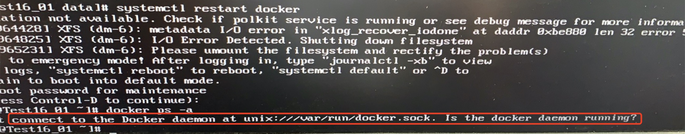
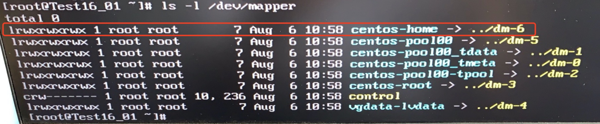
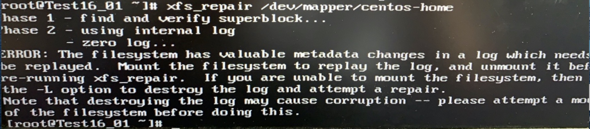
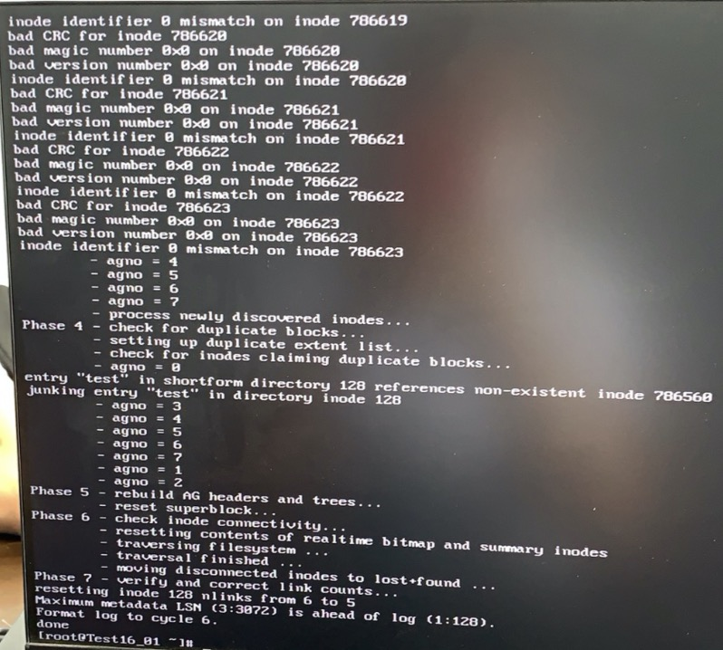

# 故障解决排查

### No1、give root password for maintenance (or type control-D to continue)

##### Question:
在系统重启或突然断电重启后造成系统文件丢失，提示`give root password for maintenance (or type control-D to continue)`的时候,先正常输入root密码进入系统。排查一下系统其他服务是否正常。

例：本机上安装docker服务就无法使用。
`docker ps -a`

Cannot connect to the Docker daemon at unix:///var/run/docker.sock. Is the docker daemon run

通过上述报错信息查看,是由于XFS文件系统error导致,下面尝试修复一下xfs文件系统。

##### solution：
综上是由于xfs文件系统dm-6错误导致,首先查看系统存储目录

1、`ls -l /dev/mapper`

2、输入`xfs_repair /dev/mapper/centos-home`

3、提示需要`-L`参数清空日志并修复`xfs_repair -L /dev/mapper/centos-home`

最后重启系统`init 6` 
