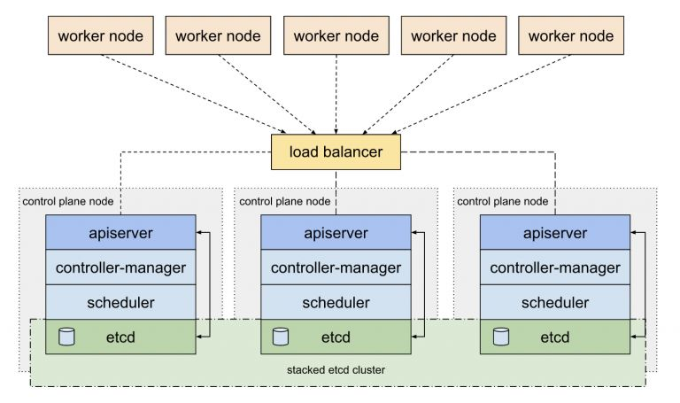
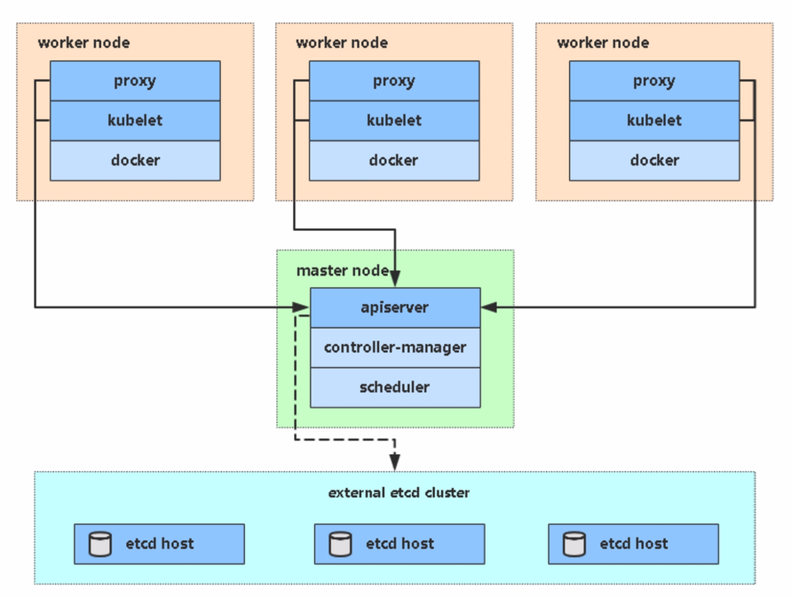

# Deploy the Kubernetes cluster

## kubernetes平台架构
- 单台master节点

- 多master节点（HA）

## 📖 Catalogue
- 1、[二进制部署](kubernetes.md)
  - 1、[创建CA证书](kubernetes.md)
  - 2、[部署etcd集群](kubernetes.md)
  - 3、[部署master节点组件](kubernetes.md)
    - 1、kube-apiserver部署
    - 2、kube-controller-manager部署
    - 3、kube-scheduler部署
  - 4、[部署node节点组件](kubernetes.md)
    - 1、kubelet部署
    - 2、kube-proxy部署
- [更新中....]()
- 2、Flannl部署
- 3、CoreDNS部署
- 4、Dashboard